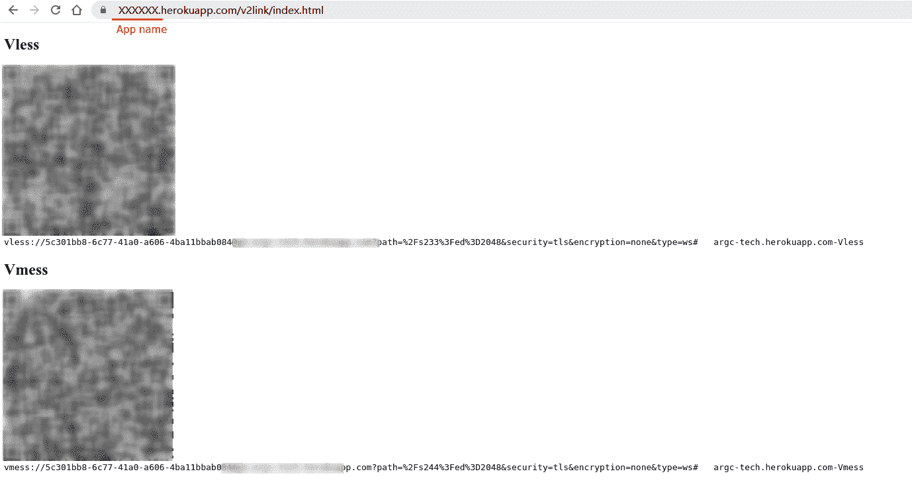

# Xray快速部署到Heroku/Okteto

Vless & Vmess: 

[](https://dashboard.heroku.com/new?template=https://github.com/qtghui/hkxrvdsw01.git) 

[](https://cloud.okteto.com/deploy)


默认访问

XXX.herokuapp.com/v2link/index.html

或 

XXX.cloud.okteto.net/v2link/index.html

获取vless、vmess链接和二维码




## Heroku部署问题

如果遇到：

> We couldn't deploy your app because the source code violates the Salesforce Acceptable Use and External-Facing Services Policy.

请Fork一下仓库，然后在自己的仓库下点击。


## 自定义静态HTML页面
仓库地址
```
https://github.com/happyevero/Html
```

